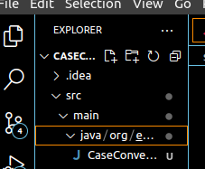
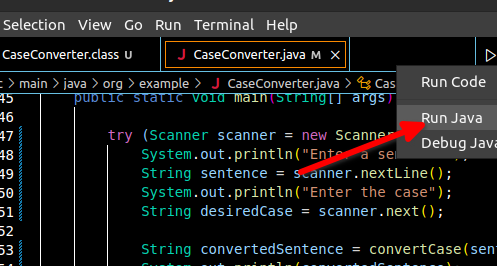

### Project requirements

1.Java version 11 or later installed on your machine 

2.Any editor of your choice e.g vs code or intellij

  ### Steps to run project

 1.Clone the repo into your machine

 2.Once cloned, open the project using VS Code or the editor you selected.

 3.Navigate through the folder structure and open the CaseConverter file.This is a sample of the folder structure in vs code but it is similar in all editors.
       

4. Open CaseConverter file then press the run button to run the project.The image below is a sample in vs code.

    

  
5. After that, a prompt will appear from the command line.Follow the instructions in the command line.

  
